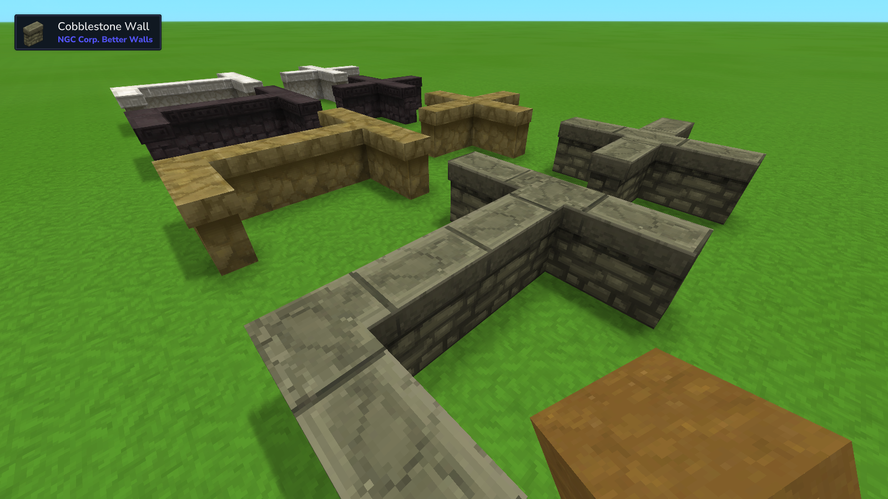
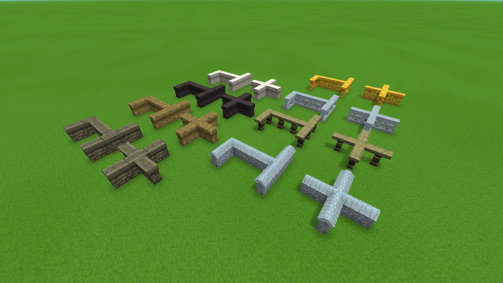

# NGC Corp. Better Walls

Introduces new wall connection shapes including T-Junctions and Cross-Junctions. The mod operates independently from vanilla assets and does not override or extend existing blocks, ensuring full compatibility.

⚠️ Currently supports:

- Rock-Cobble walls (stone, marble, quarzite and volcanic from v0.2.0)
- Sandstone-Cobble walls (default, red, white from v0.3.0)
- Basalt-, Slate-Cobble walls (from v0.4.0)
- Aqua-, Shale-Cobble walls (from v0.5.0)
- Hitboxes for T_Junction and Cross_Junction (default and thick, from v0.5.0)
- Calcite-Cobble wall (from v0.6.0)
- Basalt-Brick wall (from v0.6.0)
- Calcite-Brick wall (from v0.6.0)
- Gold-Brick wall (from v0.6.0)
- Volcanic-, Quarzite-Brick walls (from v0.6.0)

only. Additional wall variants will be added after further testing.

⚠️ It is strongly recommended to additionally use the mod [ExtraTooltips](https://www.curseforge.com/hytale/mods/extratooltips). Without it, it can be difficult to distinguish between different wall blocks in the inventory or crafting menu.

They:

✅ Provide T-Junction wall shapes 
✅ Provide Cross-Junction wall shapes 
❌ Do NOT connect to vanilla walls 
❌ Do NOT extend vanilla block sets 
❌ Do NOT override vanilla assets

## Contributing

Contributions are very welcome!

This mod focuses on expanding wall connection logic, but there is still room for improvement in several areas:

### Models & UVs

- Model geometry could be further optimized
- UV layouts may be improved for better texture consistency
- Small visual alignment tweaks are always appreciated

### Connection Rules (JSON)

- ConnectedBlockRule logic can likely be refined
- Edge cases (rare placement scenarios) might still exist
- Rule optimization and cleanup are encouraged

If you:

- Want to improve models
- Refactor JSON connection rules
- Optimize structure
- Fix edge cases
- Or suggest new wall shapes

Feel free to open a Pull Request or create an Issue.

All constructive contributions are appreciated!
